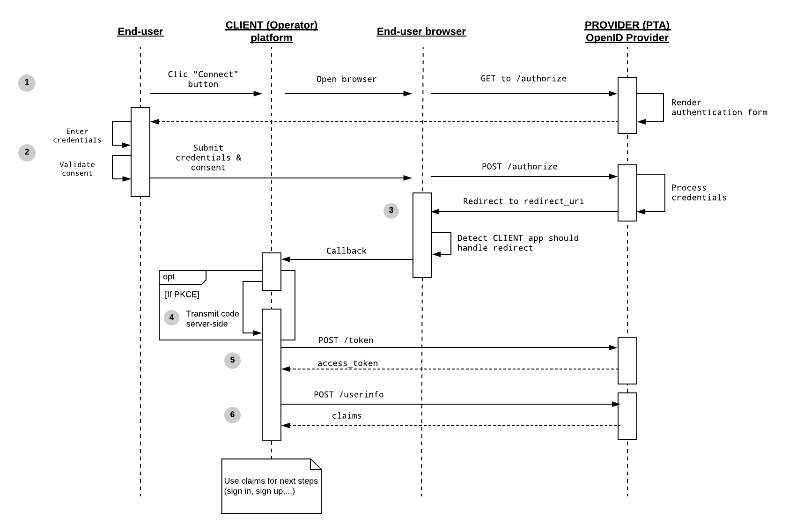

# Connect

## Functional overview

The purpose of this module is to allow a given person to authenticate on the app of a carpooling Operator using credentials from a Public Transport Authority platform (PTA). It is an essential pre-requisite to closest integrations between Operators and PTA platforms.

The following use-cases are covered:
* Sign-on an Operator app using an existing PTA account,
* Associating an existing user account on an Operator app to an existing account on a PTA platform.

This module MUST be designed to be fully compliant with European data protection regulations and more specifically the [European General Data Protection Regulation (GDPR)](https://eur-lex.europa.eu/legal-content/EN/TXT/HTML/?uri=CELEX:32016R0679&from=FR).

This module SHOULD provide guidelines to ensure a high level of security, as this module MAY be used in the future to support sensitive use-cases, including payment-related features.

## Technical overview

This module is a specialization of the [OpenID Connect 1.0 specification](https://openid.net/specs/openid-connect-core-1_0.html). In this specialization :
* The PTA is the OpenID Provider (PROVIDER)
* The Operator is the Relying Party (CLIENT)

This module is follows the latest official guidelines available on implementing OAuth 2.0 for Native apps, [RCF 8252](https://tools.ietf.org/html/rfc8252) and [IETF OAuth 2.0 Security Best Practices](https://tools.ietf.org/html/draft-ietf-oauth-security-topics-15).

More specifically, it uses the [Authorization Code Flow](https://openid.net/specs/openid-connect-core-1_0.html#CodeFlowAuth) as the [Implicit Flow is known to be vulnerable](https://datatracker.ietf.org/doc/html/draft-ietf-oauth-security-topics-15#section-2.1.2).

Optionnaly, it also takes advantage of [Proof Key for Code Exchange (PKCE)](https://auth0.com/docs/flows/concepts/auth-code-pkce) to prevent the `client_secret` beeing exposed client-side. A requirement emphasized in [RCF 8252 — section-5.3.3](https://tools.ietf.org/html/rfc6819#section-5.3.3).

This specification MUST be compatible with [OpenID Connect Foundation Android SDK](https://github.com/openid/AppAuth-Android) and [OpenID Connect Foundation iOS SDK](https://github.com/openid/AppAuth-ios). These implemententations SHALL be used by the PROVIDER to support this process as they are widely supported and audited.

## Detailled flow



### <a name="connect-step-1"></a>1 - Initiate the authentication process

Authentication process is initiated by the CLIENT (Operator), by opening the authorize URL of the PROVIDER (PTA).

The authentication process MUST be initiated through an external user-agent (such as the browser or in-app browser tabs), as opposed to an embeded user-agent (such as web-views) as described in [RFC 8252 - section 4](https://tools.ietf.org/html/rfc8252#section-4).

The authorization endpoint is often `/authorize` but it MAY be something else, depending on the PROVIDER configuration. Call to the authorization endpoint is done as follow:

```
  GET /authorize?
    response_type=code
    &scope=<scope>
    &client_id=<client_id>
    &redirect_uri=<redirect_uri>
    [&code_challenge_method=<pkce_code_challenge_method>]
    [&code_challenge=<pkce_code_challenge>]
    [&state=<state>]
```

* **`response_type`**: REQUIRED. it MUST always be `code` for the “Authorization Code Grant flow”.

* **`scope`**: REQUIRED. Define the claims the CLIENT is interested about, as defined in [Requesting Claims using Scope Values](https://openid.net/specs/openid-connect-core-1_0.html#ScopeClaims). For the needs of this module, at least claims `openid` and `email` MUST be requested. While `profile` and `phone` claims MAY be requested.

* **`client_id`**: REQUIRED. The unique identifier of the CLIENT for the PROVIDER.

* **`redirect_uri`**: REQUIRED. A valid URL recognized by your mobile application as an app link. Depending on the target OS, [Android app links](https://developer.android.com/training/app-links) or [iOS universal links](https://developer.apple.com/documentation/xcode/supporting-universal-links-in-your-app) MUST be used, so only the CLIENT app is able to get the authorization callback through `redirect_uri`.

* **`pkce_code_challenge_method`**: RECOMMENDED. PKCE code challenge method, S256 (SHA-256) MUST be used if the CLIENT app supports it as mentioned in [RFC 7636 - section 4.2](https://datatracker.ietf.org/doc/html/rfc7636#section-4.2).

* **`pkce_code_challenge`**: RECOMMENDED. PKCE code challenge, see [PKCE Protocol](https://tools.ietf.org/html/rfc7636#section-4.4) for more details.

* **`state`**: OPTIONAL. Opaque value used to maintain state between the request and the callback, to prevent CSRF attacks (see [RFC 6819 - section 5.3.5](https://datatracker.ietf.org/doc/html/rfc6819#section-5.3.5).

If the PROVIDER supports Proof Key for Code Exchange (PKCE), `code_challenge` and `code_challenge_method` parameters MUST be provided. If not, the `state` parameter MUST be used to prevent CSRF attacks (see https://tools.ietf.org/html/draft-ietf-oauth-security-topics-15#section-4.7.1).

The PROVIDER response MUST be a web process allowing the end-user to enter its PROVIDER authentication credentials.

### 2 - Authenticate the end-user

Detailled specifications for the PROVIDER authentications web process are left at the discretion of the PROVIDER, given that it complies with the current specification.

It MUST be perfectly clear to the end-user that it must provide its PROVIDER credentials.

The PROVIDER authentication web process MUST includes an explicit consent from the end-user to the sharing of its personal data with the CLIENT. If the end-user refuses to give its consent to the sharing of its personal data with the CLIENT, the authentication process MUST fail.

### 3 - Handling the redirect

As the `redirect_uri` is an app link, it will allow to redirect the user back to the CLIENT app.

If the authentication process is successful, the PROVIDER MUST redirect to the `redirect_uri`. The redirect parameters MUST include `code`.

The redirect parameters MAY also include `state` if it was provided while initiating the authentication process. If so, it MUST match the `state` passed as parameter on [step 1](#connect-step-1).

If the authentication process is fails, the PROVIDER MUST also redirect to the `redirect_uri`, providing [standard error response parameters](https://openid.net/specs/openid-connect-core-1_0.html#AuthError).

### 4 - Transmit code server side (OPTIONAL)

This step is RECOMMANDED. It SHOULD NOT be implemented if PKCE is not used for this flow.

During this step, CLIENT native app MUST transmit `code` and `code_verifier` to the CLIENT server. Method for transmitting this information is left at the discretion of the CLIENT.

With this step, next steps will be performed server-side, preventing `client_secret` from beeing exposed client-side.

### 5 - Exchanging the code for tokens

Using the token endpoint of the PROVIDER with the `code` returned as a parameter of the `redirect_uri`, CLIENT can retrieve tokens enabling it to access the end-user data on the PROVIDER.

The token endpoint is often `/token` but it MAY be something else, depending on the PROVIDER configuration. Call to the token endpoint has the following signature:

```
curl -X POST '.../token' \
	 -H "Content-Type: application/x-www-form-urlencoded" \
	 -d 'grant_type=authorization_code' \
	 -d 'client_id=<client_id>' \
	 -d 'client_secret=<client_secret>' \
	 -d 'redirect_uri=<redirect_uri>' \
	 -d 'code=<code>' \
	 -d 'code_verifier=<pkce_code_verifier>'
```

* **`grant_type`**: REQUIRED. Always `authorization_code` for the “Authorization Code Grant flow”.

* **`client_id`**: REQUIRED. The unique identifier of the CLIENT for the PROVIDER.

* **`client_secret`**: REQUIRED. The secret provided to the CLIENT by the PROVIDER to authenticate itself.

* **`redirect_uri`**: REQUIRED. MUST be identical to the `redirect_uri` of [step 1](#connect-step-1).

* **`code`**: REQUIRED. The one-time authentication `code` returned as parameter of the `redirect_uri`.

* **`pkce_code_verifier`**: RECOMMENDED. If PKCE was used during [step 1](#connect-step-1).

Response from the PROVIDER MUST at least include an `access_token` and an `id_token`. It MAY also include a `refresh_token` of which usage is not part of this specification.

The `id_token` MUST be validated by the CLIENT according to [OpenID Connect 1.0 specification - section 3.1.3.7](https://openid.net/specs/openid-connect-core-1_0.html#IDTokenValidation).

### 6 - Getting user info

Using the `access_token` from the previous step, CLIENT can retrieve the end-user claims from the PROVIDER by calling the user info endpoint.

The user info endpoint is often `/userinfo` but it MAY be something else, depending on the PROVIDER configuration. Call to the user info endpoint has the following signature:

```
curl -X POST '.../userinfo' \
	 -H "Content-Type: application/x-www-form-urlencoded" \
	 -H "Authorization: Bearer <access_token>" \
	 -d 'client_id=<client_id>' \
	 -d 'client_secret=<client_secret>' \
	 -d 'scope=<scope>'
```

* **`access_token`**: REQUIRED. The `access_token` retrieved from previous step.

* **`client_id`**: REQUIRED. The unique identifier of the CLIENT for the PROVIDER.

* **`client_secret`**: REQUIRED. The secret provided to the CLIENT by the PROVIDER to authenticate itself.

* **`scope`**: REQUIRED. MUST be identical to the `scope` of [step 1](#connect-step-1).

Response from the PROVIDER SHOULD comply with [OpenID Connect 1.0 standard claims](https://openid.net/specs/openid-connect-core-1_0.html#StandardClaims). It MUST at least include the `sub` and `email` claims. It MAY also include the `email_verified`, `given_name`, `family_name` and `birthdate` claims.

## Usage guidelines

In a sign-up scenario, CLIENT SHOULD use the OpenID Connect claims to pre-fill user information.

If claims are updated on the PROVIDER platform, CLIENT SHOULD NOT update user info accordingly. After the specified flow is completed, user info SHOULD leave independently on the PROVIDER and the CLIENT platforms.

If a user decides to disconnect its PROVIDER account from the CLIENT platform, CLIENT MUST delete any record of an `access_token` or a `refresh_token` obtained from the PROVIDER for this user. CLIENT MAY also decide to disconnect the user from its platform, but no additional step SHOULD be taken by the CLIENT.